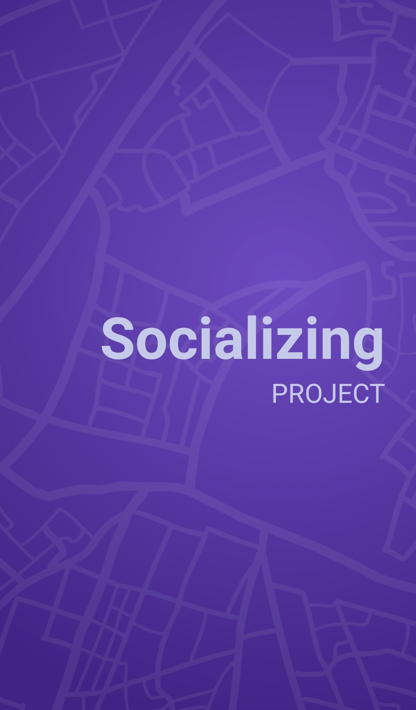
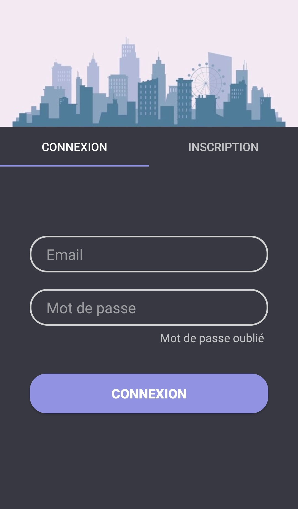
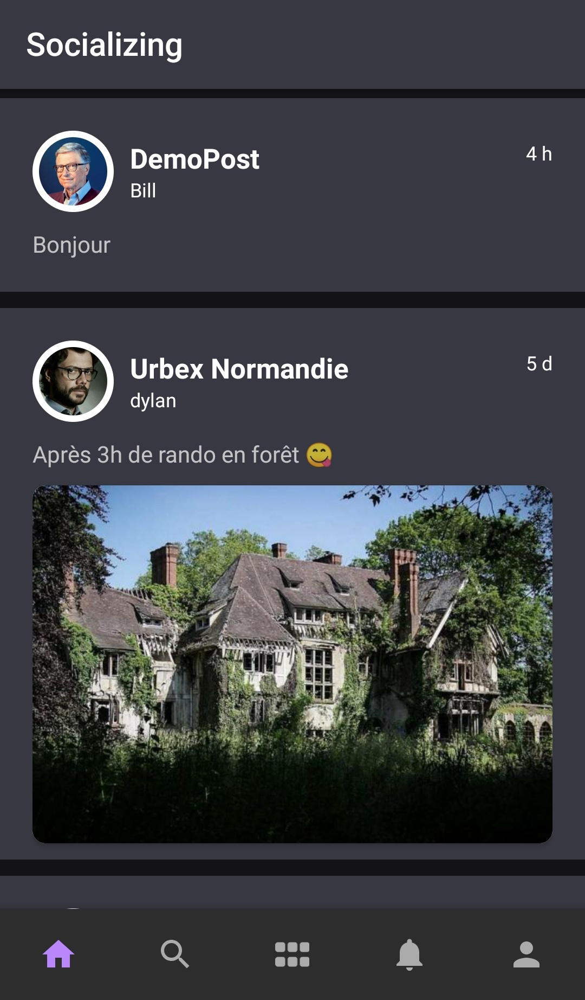
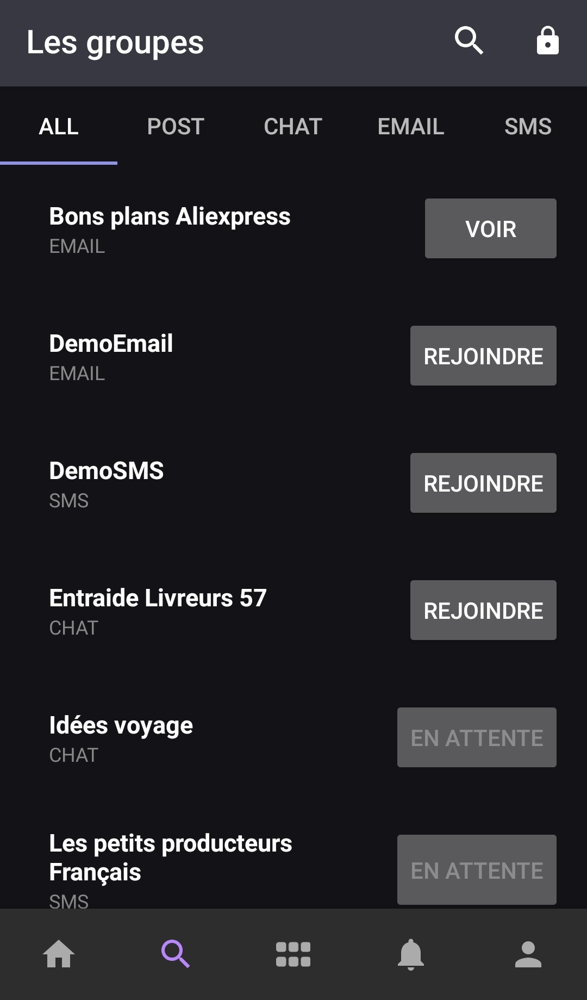
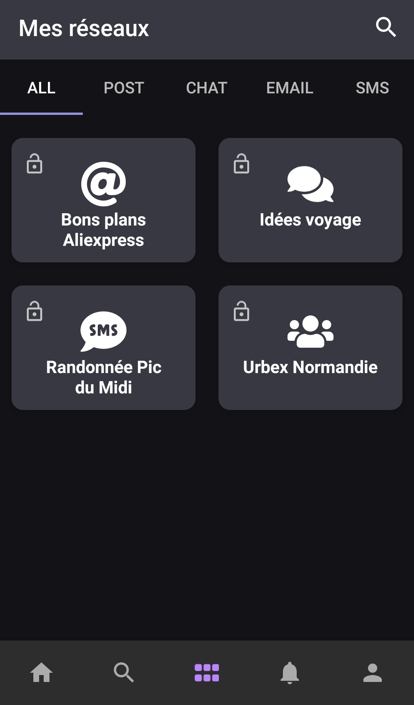

# Application Mobile : Publication et Partage de Médias

## Screenshots

  
   

    
    

   
  

  
  

## Description

Il s’agit de créer une application mobile pour offrir des services de publication et partage de
médias (textes, images, vidéo) tels que Facebook, WhatsApp ou les forums.

## Cahier des charges

L’application offre deux profils d’utilisation :

**Créateur/modérateur d’un réseau. L’application permet à ce profil de :**

1. Créer un réseau social de proximité et le configurer. Il s’agit de pouvoir 

   * Choisir le type de réseau à créer. Les types de réseaux sont :
     * Publication et partage de médias type page Facebook.
     * Publication et partage de médias type groupe WhatsApp.
     * Publication et partage via création de groupes de numéro de
       téléphones où l’échange se fait via SMS.
     * Publication et partage via création de groupes d’adresses mails.

   * Choisir les propriétés du réseau :
     * Sujets du réseau : Lié à une zone géographique/lieu, lié à un
       thème, centre d’intérêt, lié à un commerce, lié à un service, etc.
     * Nature du réseau : privé ou public.

2. Gérer les adhésions. Il s’agit de pouvoir :

   * Définir la politique de modération des demandes d’adhésions :
     * Choix du type d’adhésion : sans modération ou avec
       modération.
     * Gérer les modérateurs : ajout, suppression, etc.

   * Gérer directement les adhérents : ajouter, supprimer, modifier,
     contacter, etc.

3. Gérer les publications sur un réseau donné.

   * Publier des médias

     * Pour un réseau avec publication et partage de médias type page
       Facebook, deux politiques de publication sont possibles :

       - Les seuls habilités à publier sont le créateur et les
         modérateurs du réseau.

       + Tous les adhérents peuvent publier.

     * Pour un réseau publication et partage de médias type groupe
       WhatsApp, tous les adhérents à un groupe peuvent publier.

     * Pour un réseau de groupes de numéro de téléphones et de
       groupes d’adresses mails, seul le créateur peut publier.

   * Consulter/rechercher/visualiser et supprimer des publications.

**Utilisateur d’un réseau. L’application doit permettre de :**

1. Chercher un réseau selon le type de réseau.
2. Faire une demande d’adhésion à un réseau public. Pour les réseaux privés la
   demande se fait via un code spécifique unique pour chaque demande.
3. Consulter la liste des réseaux où l’utilisateur est adhérent, sélectionner un de
   ces réseaux et consulter les publications.
4. Consultation combinée pour les réseaux avec publication et partage de médias
   type page Facebook. L’utilisateur aura sur la même page les publications de
   tous les réseaux de ce type dont il est adhérent.
5. Avoir des alertes par rapport aux nouvelles publications et pouvoir configurer
   le mode de réception de ces alertes.

***

